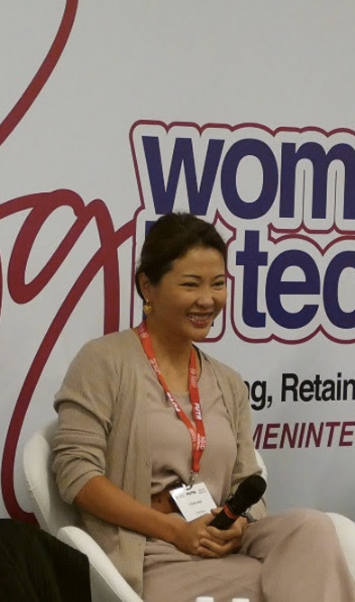

)

-   [About](javascript:void(0))
    [Team](read.html) [Partners](read.html)
-   [100 wit](javascript:void(0))
-   [Community](javascript:void(0))
-   [Calendar](gallery.html)
-   [Read](javascript:void(0))
    [Women in Tech](read.html)
-   [In the News](#)
-   [Get Involved](javascript:void(0))
    [Contact](read.html)

-   )
-   )

sgwomenintech is a community for female tech professionals {.banner-heading}
==========================================================

[Discover More](javascript:void(0))

sgwomenintech is a community for female tech professionals {.banner-heading}
==========================================================

[Discover More](javascript:void(0))

sgwomenintech is a community for female tech professionals {.banner-heading}
==========================================================

[Discover More](javascript:void(0))

1.  2.  3.  

### 2500+

Lorem Ipsum

### 2500+

Lorem Ipsum

### 2500+

Lorem Ipsum

About Us {.body-heading .text-center}
--------

SG Women In Tech, driven by the IMDA and supported by community and
industry partners, aims to attract, retain and develop talent across a
diversity of jobs in the tech/infocomm workforce.

SG Women In Tech believes in the value of a diverse workforce, and also
looks to improve perceptions of tech/infocomm careers, and looks to
establish Singapore as a progressive leader in having a globally
attractive environment and a supportive ecosystem for tech talent.

[Discover More](javascript:void(0))

100 Women in Tech {.body-heading}
-----------------

Call for applications

#### Please complete the form to apply

The 100 SWIT will be looking for individuals who have made the headlines
or influenced important stories over the past 12 months, as well as
those who have inspiring stories to tell, achieved something significant
or influenced the communities in ways that might not typically make the
news. The pool of names will then be assessed against this year's theme
– The Diversity of Female in Tech.

The call for nominations will take place from 30 March 2020 to 30 April
2020. Please access the nomination form here.

[Submit](javascript:void(0))

News {.body-heading .text-center}
----

)

March 8th, 2020 Encouraging gender diversity in Singapore’s tech sector

)

March 12th, 2020 Speak Up, Take Charge, Go All In

)

March 15th, 2020 Building the business with a diverse workforce

)

March 25th, 2020 Lorem Ipsum is simply dummy text

[More News](javascript:void(0))

Events {.body-heading .text-center}
------

)

March 25th, 2020 20/20/20 Register Now

)

March 25th, 2020 Lorem Ipsum is simply dummy text Register Now

)

March 25th, 2020 Lorem Ipsum is simply dummy text Register Now

[More Events](javascript:void(0))

Partners {.body-heading .text-center}
--------

#### Stay connected with the SGWomenInTech Community, sign up for our newsletter

Subscribe

High Street Centre, Level 8 (Collision8), \
1 North Bridge Road, Singapore 179094

Connect with us

Submit

-   [About](javascript:void(0))
    -   [Team](javascript:void(0))
    -   [Partners](javascript:void(0))
-   [100 WIT](javascript:void(0))
-   [community](javascript:void(0))

-   [Calendar](javascript:void(0))
-   [Read](javascript:void(0))
    -   [Wome in Tech](read.html)
-   [In the News](javascript:void(0))

-   [Get involved](javascript:void(0))
    -   [Connect](javascript:void(0))

#### Connect on:

-   )
-   )
-   )
-   )

[Terms of Use Privacy](javascript:void(0)) & [Cookies
Policy](javascript:void(0))
